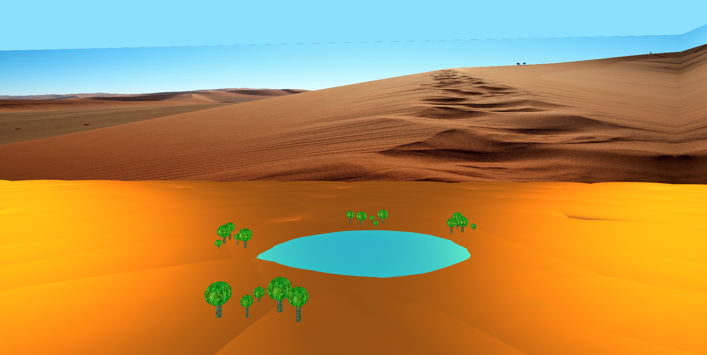
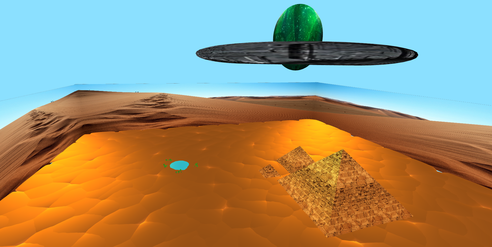

# SGI 2022/2023 - TP1

## Group T06G09
| Name             | Number    | E-Mail                    |
| ---------------- | --------- | ------------------------- |
| Ricardo Nunes    | 202109480 | up202109480@edu.fe.up.pt  |
| Luís Guimarães   | 202204188 | up202204188@edu.fe.up.pt  |

----
## Project information

- A **ComponentsGraph** data structure is created to store information about each node. After parsing the components, a check is done to verify that the graph is well defined.
- The display of the scene graph is done recursively, using a depth-first traversal of the ComponentsGraph data structure.
- Inheritance of transformations, materials and textures are guaranteed by using stacks. The scene's matrix stack is used in the case of transformations, and two stacks are created in the ComponentsGraph data structure to store material and texture ids (the actual objects stored in the scene graph are accessed when setting the appearance of the scene).

- The scene is a desert which features: 
  - an oasis composed by water surrounded by cactuses.
  - three pyramids with different sizes.
  - "walls" covered in a texture which result in an increased perceived size of the scene.
  - an easter egg: an elongated sphere and a flatten torus make up a surprising figure above ground.
  - 
  - 
  - 

----
## Issues/Problems

- The engine is sometimes more flexible than what the sxs specification allows for. 
- Spotlights don't seem to be working properly.
- Some perspective cameras appeared upside down when testing other scenes. We were not able to conclude whether this was due to a mis-configuration of the scene or a bug in our engine.
