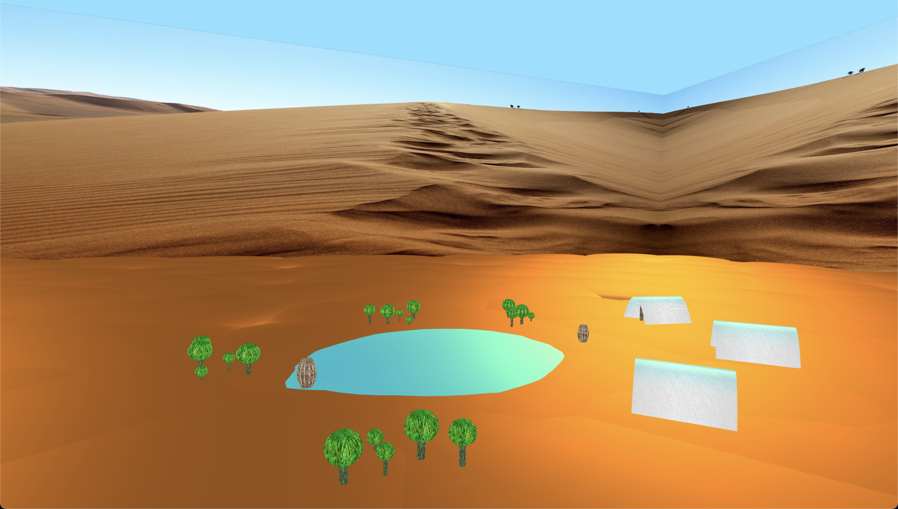

# SGI 2022/2023 - TP1

## Group T06G09
| Name             | Number    | E-Mail                    |
| ---------------- | --------- | ------------------------- |
| Ricardo Nunes    | 202109480 | up202109480@edu.fe.up.pt  |
| Luís Guimarães   | 202204188 | up202204188@edu.fe.up.pt  |

----
## Project information

- Introduced a new primitive MyPatch that is built using NURBS
- Added animation support to the engine and animations to the scene
- Added new components using the new primitive MyPatch to the scene

- The scene is a desert which features: 
  - an oasis composed by water surrounded by cactuses.
  - three pyramids with different sizes.
  - "walls" covered in a texture which result in an increased perceived size of the scene.
  - an easter egg: an elongated sphere and a flatten torus make up a surprising figure above ground.
  - 
  - 
  - 

----
## Issues/Problems

- Commit [3e31997a31d0f21be9b27000c8ee427276bd7ebe](https://git.fe.up.pt/sgi-meic/sgi-2022-2023/t06/sgi-t06-g09/-/commit/3e31997a31d0f21be9b27000c8ee427276bd7ebe) reproduces a bug with the scene file: One of the tents inherits the texture of the spaceship component which is not one of its parents.