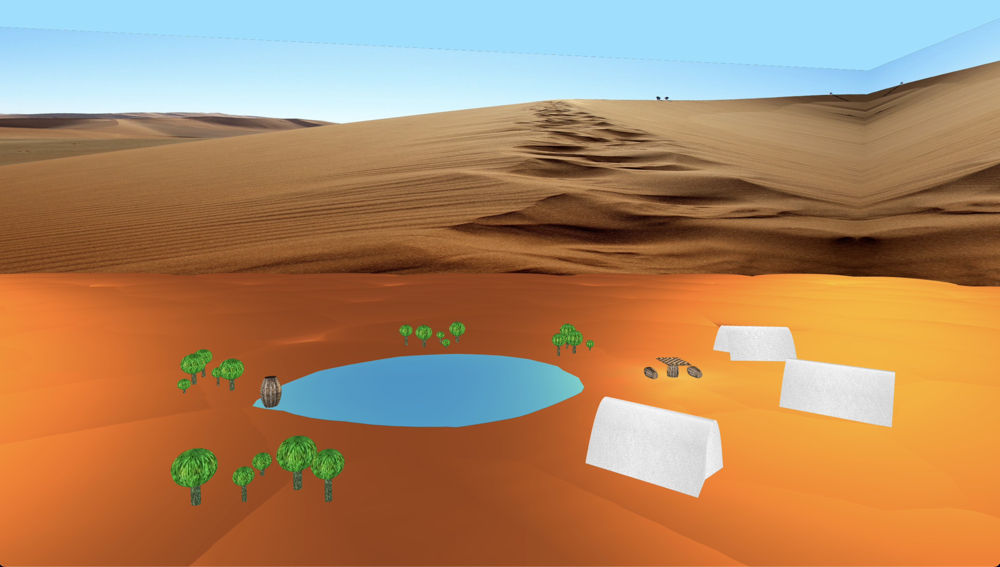
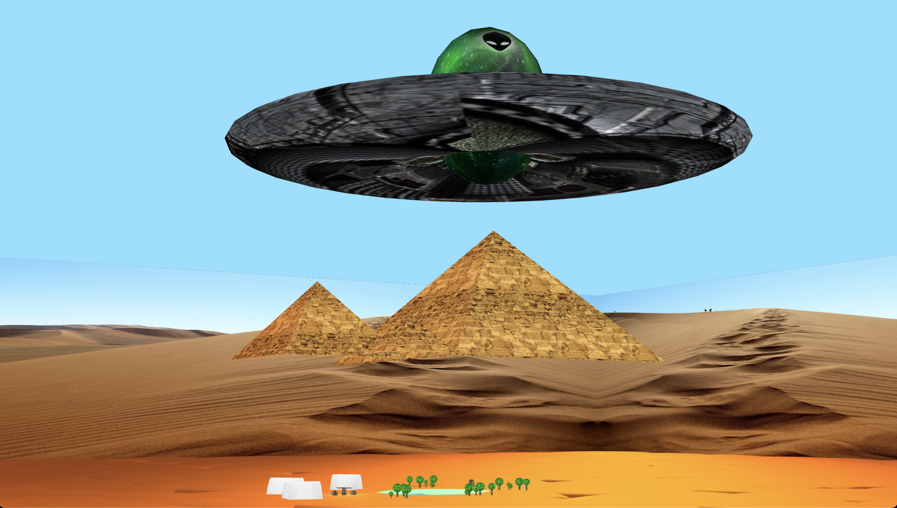

# SGI 2022/2023 - TP3

## Group T06G09
| Name             | Number    | E-Mail                    |
| ---------------- | --------- | ------------------------- |
| Ricardo Nunes    | 202109480 | up202109480@edu.fe.up.pt  |
| Luís Guimarães   | 202204188 | up202204188@edu.fe.up.pt  |

----
## Project information

### Changes
- Added a checkers game which follows [these rules](https://www.ultraboardgames.com/checkers/game-rules.php). The game starts after clicking on the game board. Its logic core is described in [`Game.js`](./objects/Game.js).

### Scene Description
- The scene is a desert which features: 
  - an oasis composed by water surrounded by cactuses.
  - tents, barrels and a game board which makes the scene look inhabited.
  - three pyramids with different sizes.
  - "walls" covered in a texture which result in an increased perceived size of the scene.
  - an easter egg: an elongated sphere and a flatten torus make up a surprising figure above ground.
  - [Scene file](./scenes/SGI_TP3.xml)
  - 
  - 
  - 
  - 
----
## Limitations
- Camera names for player 1 and 2 must be:
	- 1: "Game_camera_p0"
	- 2: "Game_camera_p1"
- Component with boards must have ID "checkers"
- The start button is the game board (only works as such before the game has started)

## Issues/Bugs:
### Features
- Spotlights are not working properly.
- Shader support was not implemented.
- The scene file in commit [3e31997a31d0f21be9b27000c8ee427276bd7ebe](https://git.fe.up.pt/sgi-meic/sgi-2022-2023/t06/sgi-t06-g09/-/commit/3e31997a31d0f21be9b27000c8ee427276bd7ebe) reproduces a bug with inheritance: One of the tents inherits the texture of the spaceship component which is not one of its parents.
### Game
- Clicking on pieces' corners, when a tile is visible and close to the mouse cursor, results in different ids being picked than the one expected.
- Collision detection could be improved. At the moment, it is not truly collision detection since we are only checking if a piece's center is approximate to another piece's center from the scene camera (`scene.camera`) perspective.
### Game Visuals
- Camera "blinks" on turn end, before it starts the rotation animation. This, however, is not observed when pressing down on the keys with codes "Digit1" and "Digit2" to switch cameras (by calling exactly the same function as in `endTurn()` in Game.js).
### Documentation
- The use of camel case vs underscore in function/variable naming is not as consistent as desired and code documentation could use some improvements.